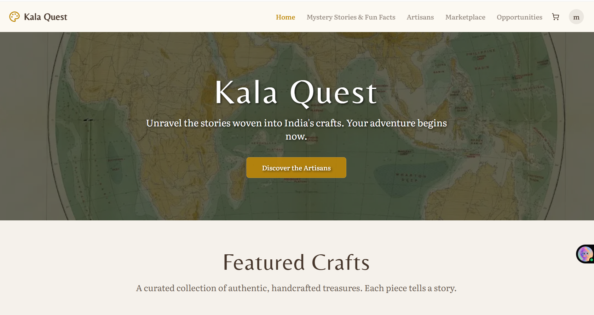
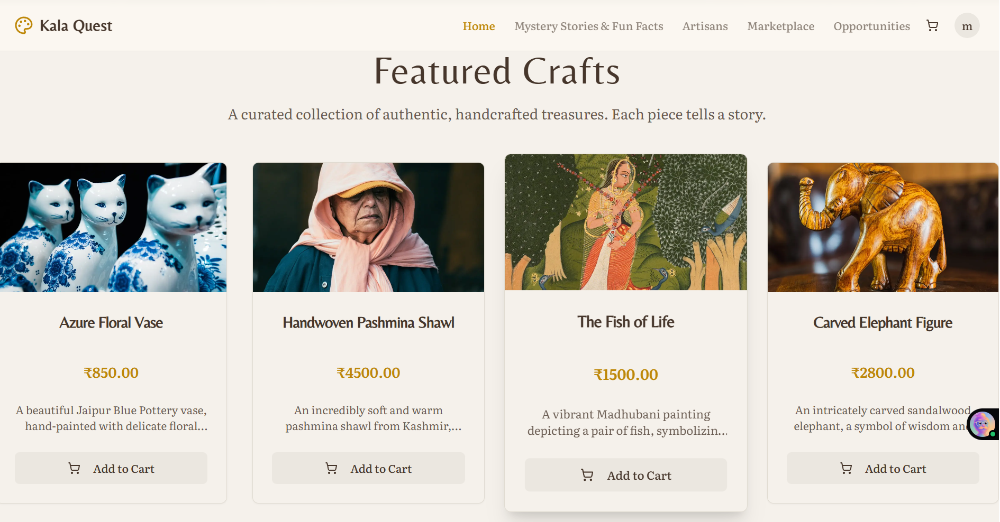
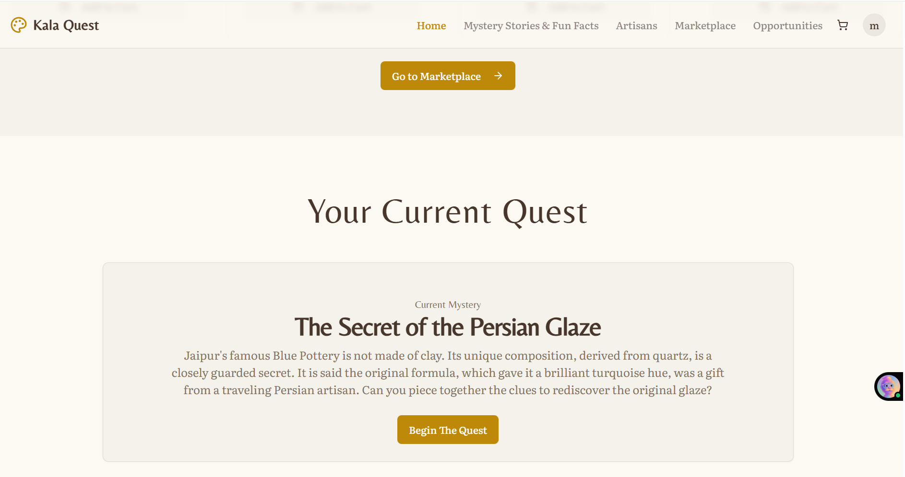
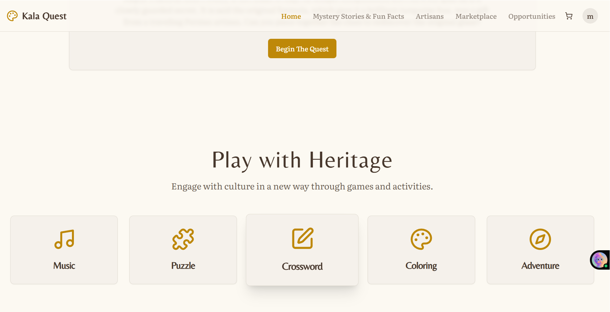

# Kala Quest
Kala Quest is an interactive web platform where users explore Indian heritage through story-based quests, culture-inspired games, and direct engagement with artisans, while supporting traditional crafts through a built-in marketplace and opportunities system.

## Live Demo
- https://kalaquest-mu.vercel.app
- https://kalaquest.vercel.app

## Features
- Mystery-driven quests with collectible clues
- Artisan profiles and product storytelling
- Personalized recommendations powered by AI
- Secure marketplace flow
- Heritage ledger for product history
- AI chatbot with long-term vector memory

## Platform Flow
Login -> Dashboard -> Featured Crafts -> Story Quest -> Interactive Play -> Cultural Exploration -> Artisan Profiles -> Marketplace -> Opportunities

## Screenshots
### Home Page


### Featured Crafts


### Quest Experience


### Play with Heritage


## What Kala Quest Does (At a Glance)
Opens with a personalized dashboard featuring curated crafts and active learning quests

Teaches art forms (e.g., Persian glaze pottery) through short narrative stories + interactive questions

Converts cultural learning into playable experiences like pottery simulations, puzzles, mandala coloring, and heritage crosswords

Lets users explore India state by state through focused cultural stories

Connects users directly with artisans via profiles, products, and commissions

Supports artisan livelihoods through marketplace purchases and work opportunities

## Tech Stack
- Next.js 15, React 19, TypeScript
- Tailwind CSS, Radix UI, shadcn/ui-style components
- Firebase (Auth + Firestore)
- Genkit + Google GenAI

## Getting Started
1. Install dependencies:
```bash
npm install
```
2. Create `.env.local` and set your model key:
```bash
GOOGLE_API_KEY=your_own_google_ai_key
```
3. Start dev server:
```bash
npm run dev
```

The app runs on `http://localhost:9002`.

## API Key Setup (Important)
- Use your own model key in `.env.local`: `GOOGLE_API_KEY` or `GEMINI_API_KEY`.
- Restart the server after changing the key.
- Do not use Firebase `apiKey` (from `src/firebase/config.ts`) for chatbot model calls.

## Chatbot UI
- Open `http://localhost:9002/chatbot`
- The page keeps one `conversationId` per `userId` in browser local storage.
- Signed-in users use Firebase UID automatically.
- Guests can set a custom `userId`.
- `New Conversation` creates a fresh thread ID for that user.

## Chatbot API (`/api/chatbot`)
The backend stores vector memories in Firestore and retrieves relevant memories by cosine similarity.

### `mode: "chat"`
- Required: `userId`, `message`
- Optional: `conversationId`, `topK`, `maxScan`, `historyLimit`, `remember`
- Returns: `answer`, `conversationId`, `relatedMemories`, `storedMemories`

Example:
```bash
curl -X POST http://localhost:9002/api/chatbot \
  -H "Content-Type: application/json" \
  -d '{
    "mode": "chat",
    "userId": "user-123",
    "conversationId": "conv-abc",
    "message": "Plan my weekend based on my preferences"
  }'
```

### `mode: "remember"`
- Required: `userId`, `remember` (`string` or `string[]`)

### `mode: "search"`
- Required: `userId`, `query` (or `message`)
- Optional: `topK`, `maxScan`

### Inline memory
If a chat message starts with `remember ...`, it is auto-stored as memory.

## Scripts
- `npm run dev`
- `npm run build`
- `npm run start`
- `npm run lint`
- `npm run typecheck`
- `npm run genkit:dev`
- `npm run genkit:watch`

## Project Structure
- `src/app` - Next.js App Router pages and API routes
- `src/components` - shared UI components
- `src/firebase` - Firebase configuration and helpers
- `src/ai` - Genkit setup, chatbot logic, vector memory
- `docs` - product blueprint and backend notes
